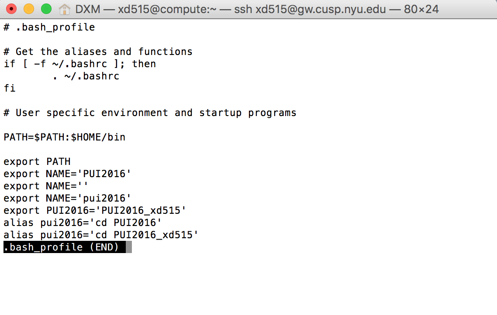
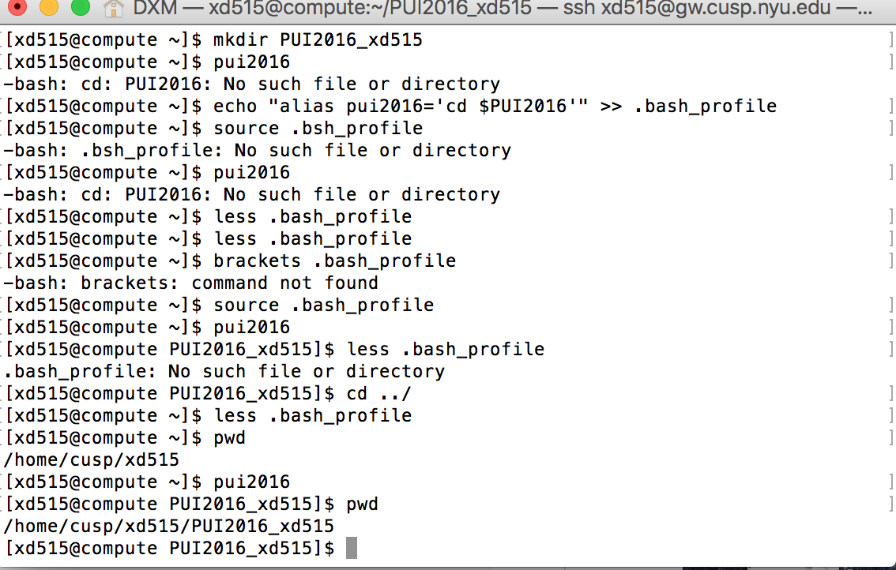

During the process I worked on my own, but when met with problems I turned to my classmates Yao Wang and Cheng Hou for the answers. \n
The steps to set up my environment: \n
    1. Modify a file.   -less .bash_profile \n
    2. Create the environmental variable.  -echo "export PUI2016='PUI2016_xd515'" >> .bash_profile
    3. Tell the terminal the change.  -source .bash_profile
    4. Pronounce the name I have set for the environmental variable.   -echo $PUI2016

