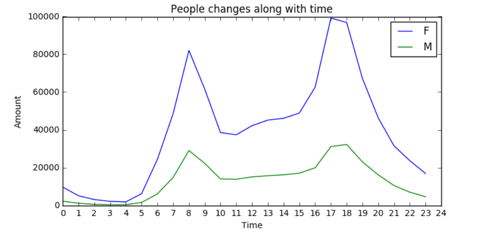

Hey Xiaomeng,

The data is represented in the right way – and the visualization represents the interpretation of the data

The addition to the plot that could be needed to make it more intuitive would be:

=> The legend of the plot could have had the whole word – Male and Female which would have made the plot more readable and understandable

=> The F and M just makes it confusing to the reader for which he then has to go back to the data and see what it meant in the first place

=> The title and the axis labels are good and need no editing but there is a caption or explanation missing from the plot and that again could make the reader confused so as to make him/her go back and look at the data instead of just visualizing it on a whole

=> In terms of formatting I think the Title and the Axis labels could have been made BOLD – that would have made the plot stand out and the reader would not have had to look in closer to read the labels

Overall, I think it is a great plot and it represents the data very well.

