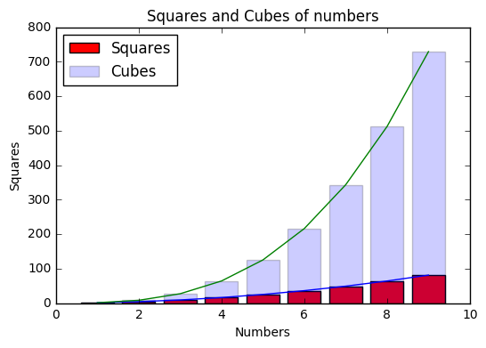

The plot shows the square and the cube of the same number at the same time. It is easy to figure out the difference for me by the different colors. The plot has clear title and legend for readers to make sense the meaning of it. The plot is honestly reproducing the data.
