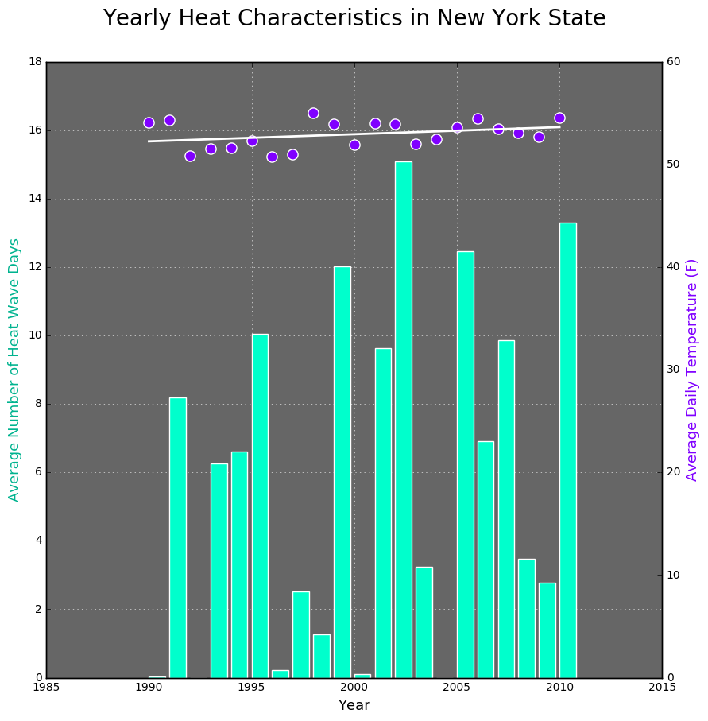

This plot shows me two parts of content, the average number of heat wave days and the average daily temperature (F). It is easy for me to figure it out seperately, however, I feel it a bit difficult to read the two parts at the same time. There is no intuitive connection between the two parts. Maybe the problem is that the average number of heat wave days should be expressed by a broken line. The color of the plot is clear, and the darker background is helpful to show the lighter colors of bars and dots. 
